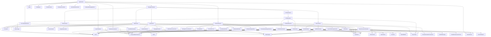

```mermaid
graph TD;
    AboutFeature-->HowItWorksFeature;
    AboutFeature-->Constants;
    ActivityFeature-->ProfileFeature;
    AddFeature-->CupertinoMessageFeature;
    AddFeature-->Colors;
    AddFeature-->GodClient;
    AddFeature-->NameImage;
    AddFeature-->ButtonStyles;
    AddFeature-->ContactsClient;
    AddFeature-->UIApplicationClient;
    AddFeature-->ComposableArchitecture;
    AppFeature-->LaunchFeature;
    AppFeature-->OnboardFeature;
    AppFeature-->NavigationFeature;
    AppFeature-->ForceUpdateFeature;
    AppFeature-->MaintenanceFeature;
    AppFeature-->Build;
    AppFeature-->TcaHelpers;
    AppFeature-->StoreKitClient;
    AppFeature-->FirestoreClient;
    AppFeature-->FirebaseCoreClient;
    AppFeature-->UserNotificationClient;
    AppFeature-->FirebaseMessagingClient;
    CashOutFeature-->Lottie;
    CashOutFeature-->ComposableArchitecture;
    CupertinoMessageFeature-->SwiftUIMessage;
    CupertinoMessageFeature-->ComposableArchitecture;
    ForceUpdateFeature-->Colors;
    ForceUpdateFeature-->Constants;
    ForceUpdateFeature-->ComposableArchitecture;
    GodFeature-->PollFeature;
    GodFeature-->CashOutFeature;
    GodFeature-->PlayAgainFeature;
    GodModeFeature-->Colors;
    GodModeFeature-->GodClient;
    GodModeFeature-->ButtonStyles;
    GodModeFeature-->StoreKitClient;
    GodModeFeature-->StoreKitHelpers;
    GodModeFeature-->ComposableArchitecture;
    HowItWorksFeature-->Lottie;
    HowItWorksFeature-->Colors;
    HowItWorksFeature-->ButtonStyles;
    HowItWorksFeature-->ComposableArchitecture;
    InboxFeature-->RevealFeature;
    InboxFeature-->GodModeFeature;
    InboxFeature-->ShareScreenshotFeature;
    InboxFeature-->NotificationCenterClient;
    InboxFeature-->AnimationDisableTransaction;
    LaunchFeature-->Colors;
    LaunchFeature-->ComposableArchitecture;
    MaintenanceFeature-->Colors;
    MaintenanceFeature-->ComposableArchitecture;
    ManageAccountFeature-->Colors;
    ManageAccountFeature-->ColorHex;
    ManageAccountFeature-->ButtonStyles;
    ManageAccountFeature-->LabeledButton;
    ManageAccountFeature-->ComposableArchitecture;
    NavigationFeature-->AboutFeature;
    NavigationFeature-->ActivityFeature;
    NavigationFeature-->AddFeature;
    NavigationFeature-->GodFeature;
    NavigationFeature-->InboxFeature;
    OnboardFeature-->HowItWorksFeature;
    OnboardFeature-->GodClient;
    OnboardFeature-->Constants;
    OnboardFeature-->PhotosClient;
    OnboardFeature-->StringHelpers;
    OnboardFeature-->ContactsClient;
    OnboardFeature-->RoundedCorner;
    OnboardFeature-->UserDefaultsClient;
    OnboardFeature-->FirebaseAuthClient;
    OnboardFeature-->FirebaseStorageClient;
    OnboardFeature-->PhoneNumberDependencies;
    PlayAgainFeature-->ComposableArchitecture;
    PollFeature-->Colors;
    PollFeature-->GodClient;
    PollFeature-->ButtonStyles;
    PollFeature-->LabeledButton;
    PollFeature-->FeedbackGeneratorClient;
    PollFeature-->ComposableArchitecture;
    ProfileEditFeature-->ManageAccountFeature;
    ProfileEditFeature-->UserDefaultsClient;
    ProfileEditFeature-->FirebaseAuthClient;
    ProfileEditFeature-->AsyncValue;
    ProfileEditFeature-->GodClient;
    ProfileFeature-->ShopFeature;
    ProfileFeature-->ProfileEditFeature;
    ProfileFeature-->ProfileShareFeature;
    ProfileFeature-->NameImage;
    ProfileFeature-->AsyncValue;
    ProfileShareFeature-->Colors;
    ProfileShareFeature-->GodClient;
    ProfileShareFeature-->ButtonStyles;
    ProfileShareFeature-->AnimationDisableTransaction;
    ProfileShareFeature-->ComposableArchitecture;
    RevealFeature-->Colors;
    RevealFeature-->GodClient;
    RevealFeature-->ButtonStyles;
    RevealFeature-->StoreKitClient;
    RevealFeature-->ComposableArchitecture;
    ShareScreenshotFeature-->AsyncValue;
    ShareScreenshotFeature-->PhotosClient;
    ShareScreenshotFeature-->ComposableArchitecture;
    ShopFeature-->Colors;
    ShopFeature-->GodClient;
    ShopFeature-->SearchField;
    ShopFeature-->ButtonStyles;
    ShopFeature-->ComposableArchitecture;
```