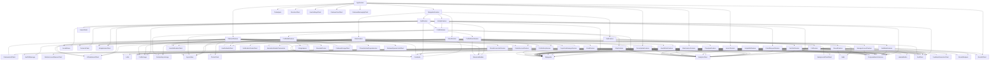

```mermaid
graph TD;
    AboutFeature-->EmailFeature;
    AboutFeature-->HowItWorksFeature;
    AboutFeature-->DeleteAccountFeature;
    AboutFeature-->Build;
    AboutFeature-->Constants;
    AboutFeature-->SwiftUIMessage;
    AboutFeature-->UIPasteboardClient;
    ActivityFeature-->ProfileFeature;
    AddFeature-->ProfileFeature;
    AddFeature-->FriendRequestFeature;
    AddFeature-->Constants;
    AddFeature-->GodClient;
    AddFeature-->Styleguide;
    AddFeature-->SocialShare;
    AddFeature-->SearchField;
    AddFeature-->ProfileImage;
    AddFeature-->ContactsClient;
    AddFeature-->AnalyticsClient;
    AddFeature-->ShareLinkBuilder;
    AddFeature-->UIPasteboardClient;
    AddFeature-->UIApplicationClient;
    AddFeature-->ComposableArchitecture;
    AppFeature-->LaunchFeature;
    AppFeature-->OnboardFeature;
    AppFeature-->NavigationFeature;
    AppFeature-->ForceUpdateFeature;
    AppFeature-->MaintenanceFeature;
    AppFeature-->TcaHelpers;
    AppFeature-->StoreKitClient;
    AppFeature-->FirestoreClient;
    AppFeature-->UserSettingsClient;
    AppFeature-->FirebaseCoreClient;
    AppFeature-->FirebaseMessagingClient;
    CashOutFeature-->Lottie;
    CashOutFeature-->Styleguide;
    CashOutFeature-->AnalyticsClient;
    CashOutFeature-->FeedbackGeneratorClient;
    CashOutFeature-->ComposableArchitecture;
    CupertinoMessageFeature-->SwiftUIMessage;
    CupertinoMessageFeature-->ComposableArchitecture;
    DeleteAccountFeature-->Styleguide;
    DeleteAccountFeature-->AnalyticsClient;
    DeleteAccountFeature-->FirebaseAuthClient;
    DeleteAccountFeature-->DeleteAccountReasonClient;
    DeleteAccountFeature-->ComposableArchitecture;
    EmailFeature-->Constants;
    EmailFeature-->Styleguide;
    EmailFeature-->AnalyticsClient;
    EmailFeature-->UIPasteboardClient;
    EmailFeature-->ComposableArchitecture;
    ForceUpdateFeature-->Constants;
    ForceUpdateFeature-->Styleguide;
    ForceUpdateFeature-->AnalyticsClient;
    ForceUpdateFeature-->ComposableArchitecture;
    FriendRequestFeature-->GodClient;
    FriendRequestFeature-->Styleguide;
    FriendRequestFeature-->ProfileImage;
    FriendRequestFeature-->AnalyticsClient;
    FriendRequestFeature-->BackgroundClearSheet;
    FriendRequestFeature-->ComposableArchitecture;
    GodFeature-->PollFeature;
    GodFeature-->CashOutFeature;
    GodFeature-->PlayAgainFeature;
    GodFeature-->UserNotificationClient;
    GodModeFeature-->GodClient;
    GodModeFeature-->Styleguide;
    GodModeFeature-->StoreKitClient;
    GodModeFeature-->StoreKitHelpers;
    GodModeFeature-->ComposableArchitecture;
    HowItWorksFeature-->Lottie;
    HowItWorksFeature-->GodClient;
    HowItWorksFeature-->Styleguide;
    HowItWorksFeature-->AnalyticsClient;
    HowItWorksFeature-->ComposableArchitecture;
    InAppWebFeature-->Styleguide;
    InAppWebFeature-->AnalyticsClient;
    InAppWebFeature-->ComposableArchitecture;
    InboxFeature-->RevealFeature;
    InboxFeature-->GodModeFeature;
    InboxFeature-->ShareScreenshotFeature;
    InboxFeature-->Constants;
    InboxFeature-->UserDefaultsClient;
    InboxFeature-->UIApplicationClient;
    InboxFeature-->UserNotificationClient;
    InboxFeature-->NotificationCenterClient;
    InboxFeature-->AnimationDisableTransaction;
    LaunchFeature-->Styleguide;
    LaunchFeature-->ComposableArchitecture;
    MaintenanceFeature-->Styleguide;
    MaintenanceFeature-->AnalyticsClient;
    MaintenanceFeature-->ComposableArchitecture;
    ManageAccountFeature-->GodClient;
    ManageAccountFeature-->Styleguide;
    ManageAccountFeature-->LabeledButton;
    ManageAccountFeature-->AnalyticsClient;
    ManageAccountFeature-->ComposableArchitecture;
    NavigationFeature-->AboutFeature;
    NavigationFeature-->ActivityFeature;
    NavigationFeature-->AddFeature;
    NavigationFeature-->GodFeature;
    NavigationFeature-->InboxFeature;
    OnboardFeature-->HowItWorksFeature;
    OnboardFeature-->ProfileStoryFeature;
    OnboardFeature-->CupertinoMessageFeature;
    OnboardFeature-->Constants;
    OnboardFeature-->AsyncValue;
    OnboardFeature-->PhotosClient;
    OnboardFeature-->SocialShare;
    OnboardFeature-->ProfileImage;
    OnboardFeature-->StringHelpers;
    OnboardFeature-->ContactsClient;
    OnboardFeature-->RoundedCorner;
    OnboardFeature-->AnalyticsClient;
    OnboardFeature-->ShareLinkBuilder;
    OnboardFeature-->UIPasteboardClient;
    OnboardFeature-->UserDefaultsClient;
    OnboardFeature-->UIApplicationClient;
    OnboardFeature-->FirebaseAuthClient;
    OnboardFeature-->UserNotificationClient;
    OnboardFeature-->FirebaseStorageClient;
    OnboardFeature-->PhoneNumberDependencies;
    OnboardFeature-->CachedAsyncImage;
    OnboardFeature-->FirebaseDynamicLinkClient;
    PlayAgainFeature-->GodClient;
    PlayAgainFeature-->Styleguide;
    PlayAgainFeature-->AnalyticsClient;
    PlayAgainFeature-->ShareLinkBuilder;
    PlayAgainFeature-->ComposableArchitecture;
    PollFeature-->GodClient;
    PollFeature-->Styleguide;
    PollFeature-->LabeledButton;
    PollFeature-->AnalyticsClient;
    PollFeature-->FeedbackGeneratorClient;
    PollFeature-->CachedAsyncImage;
    PollFeature-->ComposableArchitecture;
    ProfileEditFeature-->ManageAccountFeature;
    ProfileEditFeature-->DeleteAccountFeature;
    ProfileEditFeature-->AsyncValue;
    ProfileEditFeature-->StringHelpers;
    ProfileEditFeature-->ProfileImage;
    ProfileEditFeature-->UserDefaultsClient;
    ProfileEditFeature-->FirebaseStorageClient;
    ProfileFeature-->ShopFeature;
    ProfileFeature-->ProfileEditFeature;
    ProfileFeature-->ProfileShareFeature;
    ProfileFeature-->AsyncValue;
    ProfileFeature-->AnalyticsClient;
    ProfileFeature-->CachedAsyncImage;
    ProfileShareFeature-->ProfileStoryFeature;
    ProfileShareFeature-->CupertinoMessageFeature;
    ProfileShareFeature-->Constants;
    ProfileShareFeature-->GodClient;
    ProfileShareFeature-->AnalyticsClient;
    ProfileShareFeature-->ShareLinkBuilder;
    ProfileShareFeature-->UIPasteboardClient;
    ProfileShareFeature-->UIApplicationClient;
    ProfileShareFeature-->BackgroundClearSheet;
    ProfileShareFeature-->AnimationDisableTransaction;
    ProfileStoryFeature-->Styleguide;
    ProfileStoryFeature-->ProfileImage;
    ProfileStoryFeature-->ComposableArchitecture;
    RevealFeature-->Build;
    RevealFeature-->GodClient;
    RevealFeature-->Styleguide;
    RevealFeature-->ProfileImage;
    RevealFeature-->StoreKitClient;
    RevealFeature-->StoreKitHelpers;
    RevealFeature-->AnalyticsClient;
    RevealFeature-->ComposableArchitecture;
    ShareScreenshotFeature-->AsyncValue;
    ShareScreenshotFeature-->PhotosClient;
    ShareScreenshotFeature-->ComposableArchitecture;
    ShopFeature-->GodClient;
    ShopFeature-->Styleguide;
    ShopFeature-->ProfileImage;
    ShopFeature-->AnalyticsClient;
    ShopFeature-->ComposableArchitecture;
```